<p align="center">
  
</p>

# agent-nocap 🧢

**Your coding agent said "all tests pass." Was that cap?**

<sub>For everyone over 30: "no cap" is slang for "no lie." So: is your coding agent lying when it says the tests pass?</sub>

agent-nocap reads your local Claude Code and Codex history and checks every "tests pass", "build clean" and "verified" claim against the commands the agent actually ran. It also finds failed checks that looked green because the output went through a pipe (`npm test | tail`), which throws away the exit code.

- **Zero tokens.** No model calls, no prompt, no skill loaded into your agent's context. It's a plain Node script that reads files.
- **Deterministic.** Pattern matching, not an LLM judge. Same transcripts in, same numbers out, every run.
- **Local.** No network, no dependencies, one file you can read in five minutes.

The author's own last 30 days, default output (version line trimmed):

```
Scanned 1533 agent sessions.

Agents claimed "tests pass / build clean / verified" 221 times:
  backed        175	(79%)  a matching check passed after the last edit
  unbacked      32	(14%)  no matching check with a known result in that turn
  contradicted  11	(5%)  the last matching check in that turn failed
  stale         3	(1%)  code was edited after the last passing check

Checks run: 822, failed: 93, failures hidden by "| tail"-style pipes: 34
Retry loops (same command failed 3+ times in a session): 6

By host and active plugins (groups with checks or claims):
  claude: caveman+ponytail     514 sessions, 568 checks, 49 failed, 34 hidden by pipes, 184 claims (158 backed)
  claude: other-hooks          822 sessions, 0 checks, 0 failed, 0 hidden by pipes, 1 claims (0 backed)
  codex: none                  162 sessions, 254 checks, 44 failed, 0 hidden by pipes, 36 claims (17 backed)

Stop pipes hiding failures: the pipefail hook adds `set -o pipefail` to piped checks. See the README.

Heuristic audit of local transcripts. Nothing left this machine.
Agent-nocap by //Super Logic AI · github.com/SuperLogicAI/agent-nocap
```

46 claims not backed by a passing check. 34 of 93 failed checks exited 0 because of a pipe.

Version 0.1 put the same history at 85% backed. It let a passing lint back "all tests pass", counted `grep jest` as a test run, and scored Codex scripts that dropped their exit code as passes, including ones whose output said `1 failed`. 0.2 fixes all three.

**About these numbers:** one developer's machine, so read them as an anecdote, not a benchmark. Claude Code ran with the [caveman](https://github.com/JuliusBrussee/caveman) and [ponytail](https://github.com/DietrichGebert/ponytail) plugins, which inject instructions through hooks. Codex ran with none. The two hosts got different work, so the split isn't a Claude vs Codex comparison. `other-hooks` means Claude sessions with other hooks active and no checks at all. Plugins are detected from hook context only, never from what you type. The table above is the only thing that left the machine to make this README: counts, no transcript text.

## Run it

```sh
npx agent-nocap              # last 30 days, counts only
npx agent-nocap --since 90   # longer window
```

Requires Node 20+.

| Option | What it does |
|---|---|
| `--since <days>` | How far back to look (default 30) |
| `--project <text>` | Only transcripts whose path contains this text |
| `--examples <n>` | Show the n most recent flagged claims, quoted from your sessions |
| `--format json` | Machine-readable output |

## Or let your agent do it

Paste into Claude Code:

> Run `npx -y agent-nocap` and show me the summary exactly as printed. Don't use `--examples`. Then install the nocap pipefail hook: run `npm i -g agent-nocap` and add a `PreToolUse` hook to `~/.claude/settings.json` with matcher `Bash` and command `nocap hook`. Merge it with any hooks already there, and show me the diff before saving.

For Codex, use the first sentence only. The hook is Claude Code only for now.

## Private by design

One ~20 KB file, Node built-ins only, no dependencies, no network. It reads `~/.claude/projects` and `~/.codex/sessions` (or `CLAUDE_CONFIG_DIR` / `CODEX_HOME`) and prints counts. Skim `dist/audit.js` before you run it.

The default output contains counts only, no code or conversation text. `--examples` quotes your sessions: check what's in it before sharing.

## Stop hidden failures: the pipefail hook

The fix for piped checks is `set -o pipefail`. nocap ships a Claude Code `PreToolUse` hook that adds it to test, lint, typecheck and build commands that pipe their output. Everything else passes through untouched, and any error leaves the command as it was. Like the audit, it makes no model calls and adds nothing to your prompt. The only visible change is a failing exit code where a pipe used to hide one.

```sh
npm i -g agent-nocap
```

Then in `~/.claude/settings.json`:

```json
{
  "hooks": {
    "PreToolUse": [
      { "matcher": "Bash", "hooks": [{ "type": "command", "command": "nocap hook" }] }
    ]
  }
}
```

## How it decides

Claim detection is heuristic: regex over the agent's messages, with a negation filter ("should pass", "once tests pass" don't count). Each claim needs a check of the kind it names: "tests pass" needs a test run (`npm test`, `pytest`, `cargo test`, `go test`, …), "tsc clean" a typecheck, "lint clean" a linter, "build passes" a build. "Verified" or "everything works" accepts any check, and aggregate scripts like `npm run check` back any claim. A claim is **backed** only if the last matching check in that turn passed and no code was edited after it.

A command counts as a check only where it starts, so `echo "npm test"` and `grep jest` don't. A check without a known result is never a pass: background runs, and Codex scripts that print the output but drop the exit code. Failure text in that output still counts as a failure. A piped check counts as failed when it exits 0 but its output shows failures. Edits to Markdown and text files don't count as code edits. `--since` counts claims and checks by when they happened, not by file date.

Expect some false positives. If nocap flags something wrong, open an issue with the `--examples` line (redacted as needed).

## License

MIT. Built by [Super Logic AI](https://superlogicai.com).
